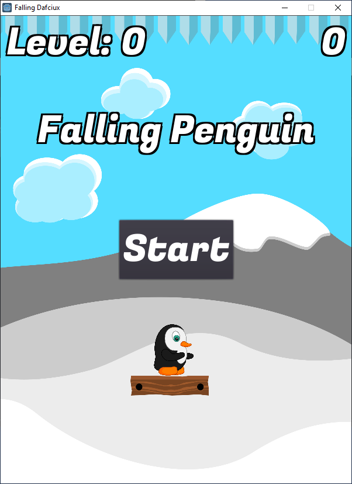
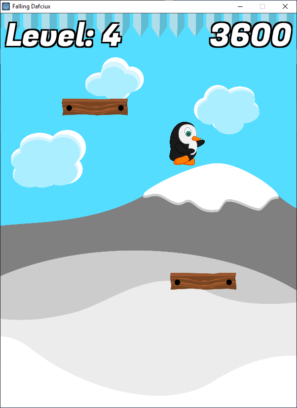

# Falling Penguin
Simple 2D Game in **Godot**

## General info
**Falling Penguin** is simple 2D game written in [Godot](https://godotengine.org).

Your objective is to survive as long as you can by avoiding spikes and fall down. Try to stay on wooden platforms :D

All graphics are made by me.

Music by Eric Matyas
www.soundimage.org

## Tools
[Godot Engine](https://godotengine.org)

[Inkscape](https://inkscape.org/)

## Screenshots

## Status
Game is not released yet. But you can clone repo and open project in Godot Engine.
